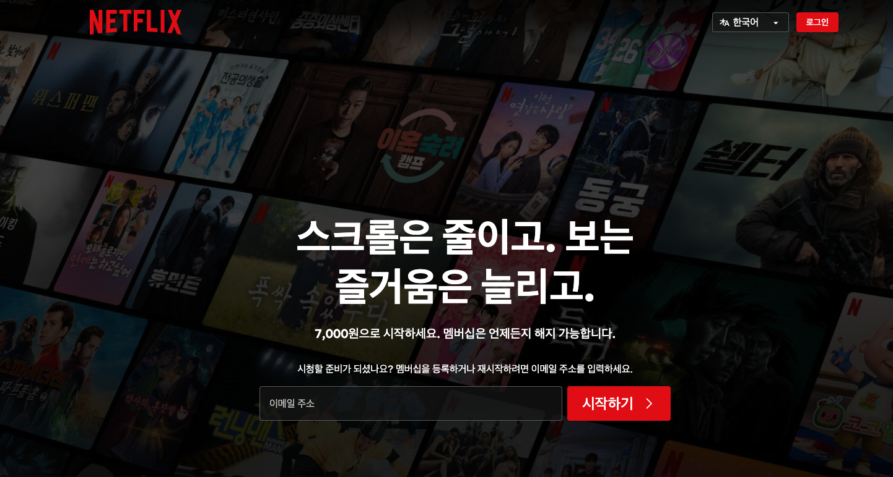

*유사 기술 블로그를 가장하기 위한 글입니다. 틀린 내용이 있을 수 있으며 도움이 되지 않을 가능성이 높습니다.*

파편적으로 머릿속에 들어있어 제대로 정리되지 않고 있던 지식들을 정리하는 시간을 가져보려 합니다.  
알고 있다라고 생각했던 개념들이 머릿속에 제대로 남아 있지 않다는 사실을 알고는 있었지만, 머릿속에 쌓이는 게 늘어날수록 쓰이지 않는 것들은 잊혀지는 게 많아지는 것 같아 생각나는 소재들을 다시 정리해 보려고 합니다.

첫 번째 소재는 인증과 인가입니다. Authentication과 Authorization. 인?증 인?가 둘 다 Auth로 시작하는데 무슨 차이인 거지? 싶습니다.

보통 웹서비스에서 사용자가 권한을 얻는 방식은 로그인(혹은 Sign in)으로 진행됩니다. 그럼 서비스들이 제공하는 인증과 인가라는 것은 무엇일까요?

오늘 글을 쓰기 전까지 보고 있던 Netflix 서비스를 기준으로 말씀드리겠습니다.

보통 넷플릭스에 처음 접근하면 아래와 같은 페이지를 보게 됩니다.

넷플릭스의 주력 서비스인 영상 감상 서비스는 이용하지 못하고, 소개 페이지와 가입을 안내하는 메시지만을 확인할 수 있습니다.

여기서 로그인 페이지를 누르고, 로그인을 하게 되면 인증과 인가가 이루어져 서비스를 사용할 수 있게 됩니다.

조금 늦었지만 여기서 인증과 인가에 대해서 간략한 설명을 드리겠습니다.

인증-Authentication은 '누구인가'를 확인하는 것입니다. kgskr.dev@gmail.com이라는 사용자가 넷플릭스에 등록된 사용자인지? 에 대한 확인입니다. 이게 다입니다.

그럼 인가-Authorization은 무엇일까요? 특정 사용자가 뭘 할 수 있는지를 결정하는 것입니다. 위 상황에서는 kgskr.dev@gmail.com이라는 사용자가 멤버십이 활성화됐는지를 확인하고, 정상적인 멤버십을 가지고 있기에 위 페이지로의 접근이 인가되었을 것입니다.

---
인증과 인가는 그럼 왜 나누어져 있을까요?

사용자로 등록이 되어만 있으면 모든 권한을 행사할 수 있는 서비스가 있다고 한다면, 아마 인가는 필요 없을 것입니다. `인증`이 이루어진 것만으로 이미 서비스의 모든 것을 누릴 수 있으니까요.  
하지만 사용자 간 하나라도 실행할 수 있는 요소에 차이가 발생한다면 그때부터는 그것을 어떻게 나눠야 할지에 대한 고민이 필요해집니다. 그리고 그 고민을 해결하기 위한 것이 `인가`입니다.

인증은 요청하는 자가 누구인가?에 대한 물음에 답인 것이고, 인가는 인증이 이루어진 사용자가 이 행동을 해도 되는가? 라는 물음에 대한 답인 것입니다.

---

그렇다면 사용자에 대한 인증은 어떤 식으로 이루어질까요?

첫 번째는 전통적인 비밀번호 인증 방식입니다. 사용자 계정, 혹은 이메일과 암호를 입력하면 서버에서 그 입력값이 올바른지 확인 후 사용자임을 확인합니다.

두 번째는 상대적 최신 기술인 Passkey입니다. 패스키 생성 시 비대칭키 쌍을 만들어 기기에 저장 후 공개키는 서버에 전달합니다. 인증 시에는 서버가 클라이언트에게 챌린지값을 제공하고 여기에 클라이언트가 개인키로 서명해 서버로 전송하면 공개키로 검증하는 방식으로 인증을 진행합니다. 비밀번호 방식과는 다르게 서버 측에는 민감값이 저장되지 않고 클라이언트 측에만 저장되기 때문에 서버 해킹 등에도 인증 정보가 탈취될 위험이 없습니다. (서버에 저장되는 공개키는 이름 그대로 공개가 가능한 키) 단, 패스키를 통한 인증을 유일한 인증 방식으로 갖는 경우 기기 분실이나 타인, 공공 기기에서의 로그인 상황과 같은 패스키 관리 도구에 접근이 어려워지는 상황에 인증이 불가능할 수 있다는 문제가 있습니다.

세 번째는 소셜 로그인 및 페더레이션 아이덴티티입니다. OIDC를 사용해 외부 서비스에 인증하는 것으로 서비스에 인증하는 방식입니다. 외부에 인증을 위임하는 방식입니다.

네 번째는 싱글 사인온(SSO)입니다. 한 번 인증하는 것으로 다른 서비스들에 접근할 수 있게 하는 인증 방식입니다. 소셜 로그인 방식은 외부에서 한 번 인증한 것으로 다른 서비스를 사용할 수 있게 되는 것이기 때문에, 싱글 사인온의 종류로 볼 수 있습니다.

다섯 번째는 다중 인증(MFA)입니다. 메일이나 OTP 등으로 복수의 인증 과정을 거치도록 해 보안을 강화합니다.

---

위와 같은 방식으로 서비스에 인증한 후 작업을 위해서는 인가를 통해 하려는 행동에 대한 허가를 받아야 합니다.

인가 방식은 대표적으로 역할 기반 액세스 제어(Role-based access control, RBAC), 속성 기반 액세스 제어(Attribute-based access control, ABAC), 관계 기반 액세스 제어(Relationship-based access control, ReBAC)가 있습니다.

RBAC는 역할에 따라 할 수 있는 권한을 나누는 방식입니다.

넷플릭스를 떠올려 보면 넷플릭스의 계정 공유 정책 변경에 따라 생긴 추가 회원과 일반 회원이 예가 될 수 있을 것 같습니다. (확실치 않음)
멤버십에 가입한 계정에 월 5,000원을 추가하면 활성화할 수 있는 계정으로, 대부분의 기능을 본 계정과 독립적으로 그대로 사용할 수 있지만, 멤버십과 관련된 기능은 접근이 불가능하며 상위 계정에 대한 정보도 확인할 수 없습니다.

ABAC는 속성에 따른 권한 부여 방식입니다.

이 사용자가 유효한 멤버십을 가지고 있는지, 이 사용자가 성인 인증이 된 사용자인지, 이 사용자가 현재 접속한 지역이 어디인지와 같은 것들을 속성으로 가지고 행동을 허가하게 됩니다. 멤버십 속성을 가지고 있는 사용자라면 영상을 볼 수 있는 권한을 줄 것이고, 성인 인증이 된 사용자라면 성인 콘텐츠를 실행할 수 있게 됩니다. 접속한 지역에 따라 이 사람이 볼 수 있는 콘텐츠를 나누어 보여주기도 합니다.

ReBAC은 위 두 가지와는 조금 다릅니다.

사용자와 리소스 간의 관계를 통해 권한을 부여합니다. 사용자는 자신이 쓴 글만 지우거나 수정을 할 수 있다. 자신의 팀원이 쓴 글은 볼 수 있지만, 다른 팀원이 쓴 글들은 볼 수 없다. 와 같이 글이라는 리소스와 사용자의 관계에 따른 권한 부여 방식입니다. Facebook이나 LinkedIn같이 1촌 2촌에 따른 공개 범위 설정이 예시가 될 수 있을 것 같습니다.

---

인증과 인가에 대한 종류까지 쓰다 보니 글이 조금 길어졌지만, 쓰고 나니 기본적인 내용들을 잘 담은 글이 된 것 같고, 머릿속 정리도 되어 뿌듯합니다. 야호~

참고 문서
- Auth0 인증과 인가: 개발자가 이해해야 할 포인트  
https://auth0.com/jp/intro-to-iam/authentication-vs-authorization
