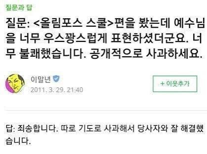

*이 글은 의식의 흐름대로 쓰여진 글입니다.*

느지막이 사무실에 출근해 확인하는 루틴 중 하나는 빌링서비스로 요금을 모니터링하는 일입니다. 제가 하는 일 중에 얼마 없는 명확하게 금전으로 연결되는 일입니다.

오늘은 확인하니 웬걸, AWS 리전에서 인터넷으로 데이터 전송비용(일 약 $15)이 막대하게 발생하고 있었습니다. 그것도 이번 주 월요일부터.

회사의 인터넷 아저씨이자 비용 단속반으로서 좌시할 수 없는 일이었습니다. 

1. 월요일에 대체 뭐가 있었을까? 이번 주부터 서비스가 활성화되긴 했는데 그것 때문인가?

2. 내부에 누군가 코드를 개판으로 짠 건가?

대충 위의 두 가지를 생각하며 범인찾기에 들어갔습니다.

Flow Log는 따로 구성해두지 않아 CloudWatch의 기본 지표와 메가존의 빌링 서비스인 하이퍼빌링의 정보로만 수사를 이어갔습니다.

그러던 중 IPSec으로 구성된 사무실과 AWS 개발 VPC 간에 굉장히 많은 데이터 통신이 있는 게 발견되었습니다. 두 곳에 데이터가 오갈 일은 개발자가 이용하는 것밖에 없으니 범인은 한 손으로 셀 수 있게 되었습니다.

그리고, 방화벽 장비의 지표를 통해 마침내 범인을 찾았습니다.

바로 저였습니다.

쿠버네티스 클러스터 관리도구로 k9s를 사용 중인데, 터미널에 Helm 리스트를 보이게끔 해둔 게 원인이었던 것입니다. k9s는 기본값으로 2초마다 클러스터에서 정보를 새로고침하는데, 이게 100mb/m 가량의 트래픽을 발생시키고 있던 겁니다.

평소에도 k9s를 터미널에 켜두고 있었는데. 보통 노드나 특정 네임스페이스의 디플로이먼트들만 보이게끔 해두다 보니 그렇게 많은 트래픽이 발생하지 않았지만 클러스터에 설치된 모든 Helm 리스트를 보는 건 가볍지 않았던 모양입니다..

아직 멍청비용이 얼마나 나올지는 금요일이 되어 봐야 알겠지만, 아마 3일간 약 $50 정도가 발생했을 것으로 생각됩니다.

범인이 확정되기 직전 누군진 모르겠지만 Slack에 박제해두고 말 테다 라며 싱글벙글하던 저는 얌전히 터미널을 종료했습니다.

아무 생각 없이 했던 행동이 이렇게 큰 대가를 가져올 줄은..
트래픽 비용의 무서움과 학습의 필요성을 느끼는 하루였습니다.

데이터 전송비용 과다 발생 범인은 검거되었지만 담당자(본인)와 원만한 합의 후 석방되었다고 합니다

