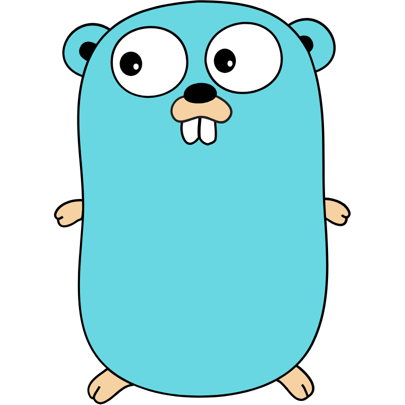

대딸깍 시대. 요즘은 누구나 컴퓨터 한쪽에 에이전트를 두고 코딩을 할 수 있는 시대가 되었습니다.

아이디어만 가지고 있으면 누구나 웹이나 모바일 웹의 방식으로 세상에 쉽게 내놓을 수 있는 편의의 시대이면서

저같이 아는 건 없으면서 LLM으로 딸깍해 회사의 돈을 훔치는 도적들이 판을 치는 무서운 시대이기도 합니다.

도적임을 들키지 않기 위해 전문가를 연기하며 필사적으로 주변 동료들에게 팔고 있는 게 있습니다.

바로 '[Go](https://go.dev/)'입니다.

어차피 딸깍으로 만들고 딸깍으로 리뷰할 거라면, 컴파일 언어가 좋지 않을까요? 하지만 러스트는 레퍼런스도 적고 아직 커뮤니티도 부족해요. 그렇다면 남은 건? 바로 Go.

라는 의식의 흐름으로 Go를 팔아보려 했지만 생각만큼 간단한 문제는 아니었습니다.

Go는 인간이 배우고 사용하기는 쉬운 언어였지만, Python, JS 같은 인터프리트 언어와 비교한다면 AI가 결과물을 내기에 가장 효율적인 언어는 아니라고 합니다.

수없이 반복되는 `if err != nil`, 선언된 채 사용되지 않는 변수를 참지 못하는 분노 조절 장애.

위와 같은 이유로 토큰 소비가 늘어나는 경향이 있어 파이썬, JS 같은 인기 인터프리트 언어들에 비해 AI를 사용한 개발에 효율이 떨어진다고 합니다.

그렇지만, 그럼에도 서비스를 만드시는 분들이라면 Go를 사용해 보시는 게 어떤가라고 말씀드리고 싶습니다.

1. 컨테이너 배포 방식이 유행하는 지금, Go는 다른 언어들과는 비교되지 않을 정도로 가볍고 효율적인 언어입니다. Scratch를 베이스 이미지로 한 컨테이너는 순식간에 스케일링될 수 있고 컴퓨터 자원 또한 매우 효율적으로 사용할 수 있습니다.
2. 고루틴으로 Python, Node.js 백엔드보다 효율적인 비용으로 동시성 처리가 가능합니다.
3. 마스코트가 귀엽습니다.

개발에 언어를 선택하는 다양한 이유들이 있겠지만, 언어의 장벽이 예전보다 훨씬 더 낮아진 지금, 컴파일 언어라는 강점과 컴파일 언어 중에서 가장 AI 효율적인 Go를 선택해 보시는 건 어떨까요? 한 번만 잡숴 보세요
