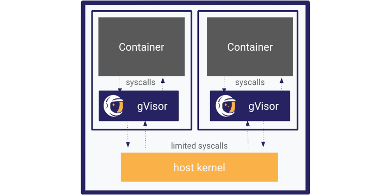

*새로 알게 되었는데 당장, 막상 쓰지는 않을 것 같아 남겨놓는 글입니다. 틀린 내용이 있을 수 있으며 도움이 되지 않을 가능성이 높습니다.*

공부를 하다 보면 아무래도 교재 등의 범위를 넘어서 학습을 하는 건 어려움이 있습니다.

제 세상 속에 OCI 컨테이너 기술은 호스트와 커널을 공유하는 단점이 있는 격리 기술이었습니다. 대표적 저수준 컨테이너 런타임인 runc와 podman에서 기본 사용되는 crun, 그리고 게 마스코트가 인상적이어서 기억하고 있는 [youki](https://github.com/youki-dev/youki)는 컨테이너 프로세스가 직접 호스트 커널에 시스템콜을 하는 방식으로 동작합니다.

아무래도 격리 환경인데 시스템콜을 직접 하는 건 좀;; 이라는 생각까지는 제 머리에는 없었는데, 우연히 [gVisor](https://gvisor.dev/)이라는 런타임을 듣게 되었습니다.

정확하게 이야기하면 저수준 런타임은 runsc라는 이름인데 어쨌든 거의 gVisor와 runsc는 묶음으로 사용하는 모양새인 것 같습니다.

그래서 gVisor가 머냐?

위 내용에서 대충 감이 오셨겠지만, 호스트에 시스템콜을 직접 하지 못하게 하는 컨테이너 런타임입니다.

원리는 호스트 커널인 척 하는 친구(Sentry)를 컨테이너와 같이 돌려 컨테이너가 시스템콜을 호스트에게 직접 하지 못하게 하는 거죠.

뭔가 istio - 사이드카 방식과 닮아 있는 구조 같습니다. (뭔가 이런 구조를 부르는 통칭이 있을 것 같은데 비루한 검색 실력으로는 찾지 못했습니다. 안타깝네요. 혹시 알고 계신 분이 있다면 [여기](https://github.com/kgskr/kgskr.github.io/issues)에 이슈를 남겨주시면 정말 감사하겠습니다.)

혹시나 GKE 환경을 사용하시는 분들이라면 [공식적으로 지원](https://docs.cloud.google.com/kubernetes-engine/docs/concepts/sandbox-pods?hl=ko)하니 한 번 사용해 보셔도 좋을 것 같습니다. (온프레미스까지는 그나마 사용해 볼 만하나 EKS에서는 공식 지원하지 않아 이점이 크지 않아 보입니다.)

더 상세한 구조까지는 정확하게 이해하지 못하여 여기까지 남기도록 하겠습니다.

