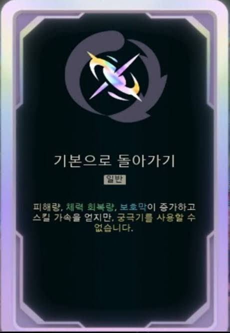
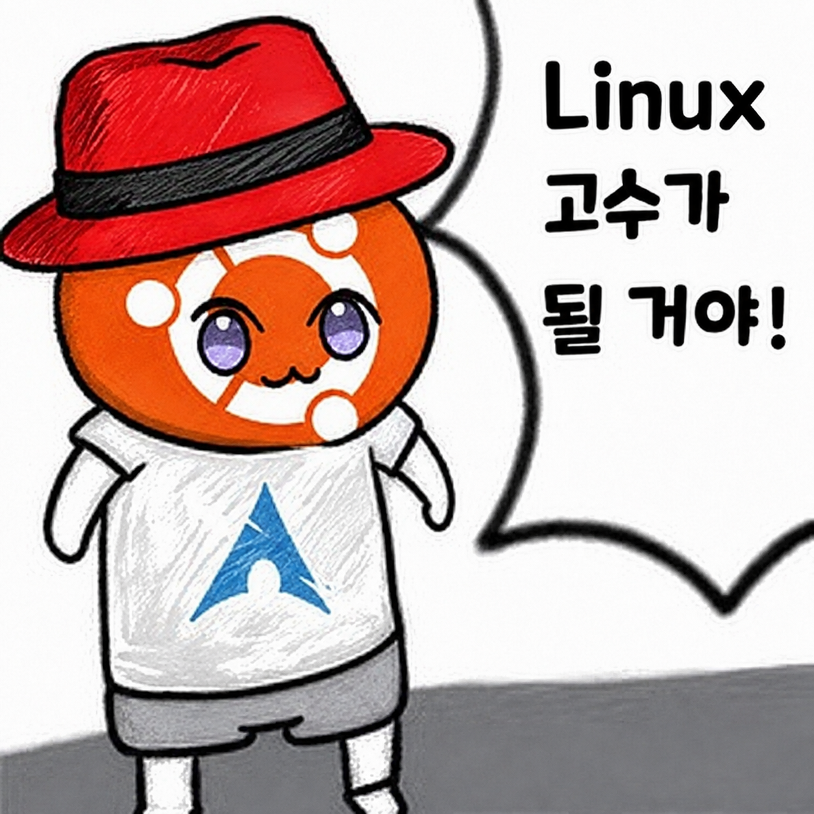

*이 글은 의식의 흐름대로 쓰여진 글입니다.*

현 직장에서 1년간의 도적질을 마칠 때가 된 것 같아 이곳저곳으로 눈을 돌려보고 있습니다.  
결과적으로, 알아야 할 것들을 아무것도 알지 못해 다른 곳으로 넘어갈 수 없는 몸이라는 걸 깨닫고 있습니다.

어떻게든 다른 거처를 마련하기 위해서 다시 '공부'라고 하는 것을 해야 할 필요를 느끼고 있습니다.

그런 의미에서 오늘의 주제는 `기본으로 돌아가기`입니다.  

아무래도 제가 담당하는 업무 범위는 서비스의 아랫단이다 보니, 기본적이고 원론적인 것에 대한 학습이 매우 중요합니다. 하지만 '취업만 하면 그만이지'라는 아주 못된 마음가짐으로 지금까지 임해왔기 때문에 다시 한번 벌을 받게 되는 것 같습니다.

벌은 피할 수 없으니 '어떻게 이 벌을 효과적으로 잘 받을 수 있을까?'라는 고민을 하고 있습니다.  
1. 나는 어떤 일을 하고 싶은 걸까?
2. 그럼 어떤 기술을 사용해야 할까?
3. 그 기술을 위해 어떤 것부터 어디까지 공부해야 할까?

조금이라도 궁금한 모든 것을 공부하고 싶지만, 그럴 능력도 없고 성격도 아니기에 정확한 학습 범위와 목표를 정하는 것이 중요하다 생각하고 있습니다.

얼마 전 Istio에 관한 글을 투고했습니다만, 이보다는 조금 더 근본이 되는 기술에 대해서 공부하고, 적는 것이 우선이라는 생각을 최근에 했습니다.  
물론 실무에 대한 것도 중요하지만, 무너지기 전 위태로운 제 지식의 성을 위해 기초 기반을 다시 보수하는 것이 우선이라는 것이 학계의 점심이 아닌가 합니다.

---
일단 가장 큰 목표는 Linux입니다. 개발이 하고 싶든, 데브옵스가 하고 싶든, 인프라 엔지니어가 되든 일단 사용되는 건 리눅스니까요.  
리눅스에 대해 다시 한번 공부한 후, 어디로 뻗어 나갈지에 대해 다시 생각해 보려 합니다.  

