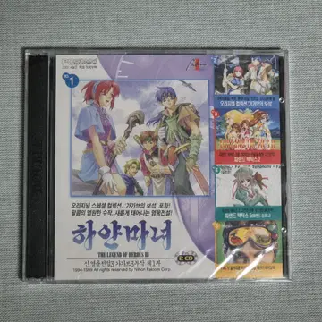

*이 글은 의식의 흐름대로 쓰인 글입니다.*

아. 추석 연휴 후 다시 3일씩 두 번이나 쉰다니. 점점 나태해지는 이 몸을 어떻게 할지 모르겠습니다.

가만히 누워 3일을 보낼 생각이었지만 10월 4일, 10월 5일 ChatGPT 사용량 초기화권이 각각 있어 이걸로 뭐든 해 봐야겠다는 생각이 들었습니다.

[Fortigate-externalDNS](https://github.com/kgskr/fortigate-externalDNS) 보안 리뷰 돌리기와 반년째 미루던 [롤 모임 내전 기록 수집기](https://github.com/kgskr/llvy) MVP 배포를 이번 3일간 마쳤습니다.

첫 번째는 6-sol과 데이브레이크 블루 권한을 사용해서 진행했고, 두 번째는 아스트라를 사용했지만, 아무래도 어느 정도 진척이 있던 프로젝트들이라 작업을 마치는 데까지 절반의 Pro 기본 요금제의 주간 사용량밖에 사용하지 않았습니다.

그럼 남은 사용량은 도대체 어디 써야 할까.. 고민하던 중, 최근 커뮤니티에서 게임 모드와 콘솔의 탈옥, 그리고 다른 플랫폼 기기로의 컨버팅이 AI를 통해 활발하게 이루어지고 있다는 내용의 글을 본 게 기억이 났습니다.

제가 결정한 것은 어린 시절 가장 인상 깊게 했던 게임인 신영웅전설3를 Swift로 포팅해 보기였습니다.

첫 시작은 재미있었습니다. 하지만 Codex의 목표 기능을 사용해 포팅 '해 줘'를 적어 두고 GPT-6 Astra가 Mac에서 제 추억을 재현해 줄 것을 기다리는 시간은 점점 길어졌습니다.

구현하고 검증하고 구현하고 검증하고. 3시간이 넘어섰을 때도 아직 시작 마을을 벗어나지 못하고 있었을 때, 뭔가 이상함을 느끼긴 했지만 처음이 오래 걸리는 법이라 생각하고 기다렸습니다.  
그렇게 10시간이 넘어가는 작업에도 진척이 크게 없음을 확인하고 코드 구현을 서브 에이전트를 사용하게 변경하고 기본적인 시스템 부분을 먼저 전체적으로 작업하게끔 했습니다.

그럼에도 빌드된 프로젝트를 리버스 엔지니어링처럼 복구하다 보니 완성도 있는 결과물을 만드는 건 사실상 건물을 겉으로만 보고 내부까지 동일하게 짓는 작업과 별반 차이가 없었습니다.  
물론 제 형편없고 맥락도 없는 해 줘 프롬프트의 문제가 가장 컸겠지만, 작업은 24시간 동안 제 초기화권을 모두 태우고도 게임 내용의 2% 정도밖에 구현하지 못했습니다.  

아. 많은 사용량을 자신한 채 자신의 무지함을 모르고 Astra에게 일임한 저는 순식간에 아무것도 할 수 없는 사람이 되어 버렸습니다.

하지만 다행히 약간의 얻어 가는 부분도 있었습니다. 장기 작업을 위한 명령은 준비를 더욱 잘해야 한다는 것.

예, 오늘도 큰 멍청 비용을 내고 남들은 다 알고 있는 교훈을 얻는 시간이었습니다.

